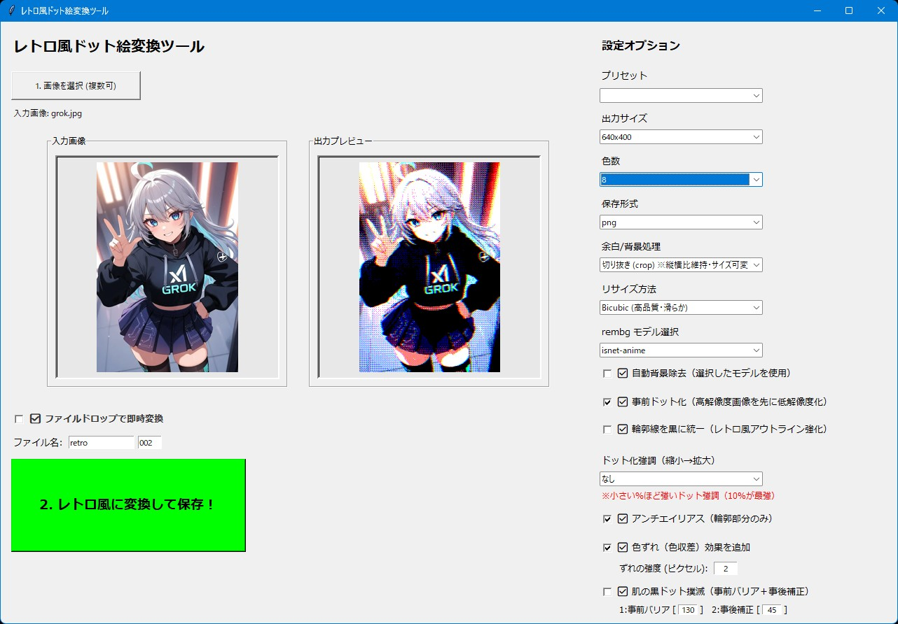

# レトロ風ドット絵変換ツール

## これは何？

画像をレトロ風ドット絵に変換するツールです。

## 使い方
1. `retro-dot-converter.py` を実行

## 必要環境
- Python 3.10以上
- 必要なライブラリはソースコードの先頭に書いてあります。（バージョンが違うと動かない可能性があるので、コメントと同じバージョン推奨）

## ライセンス

**MIT License** で公開しています。  
ご自由に使って、改変して、参考にしてください。  
ただし**自作発言はNG**でお願いします。
